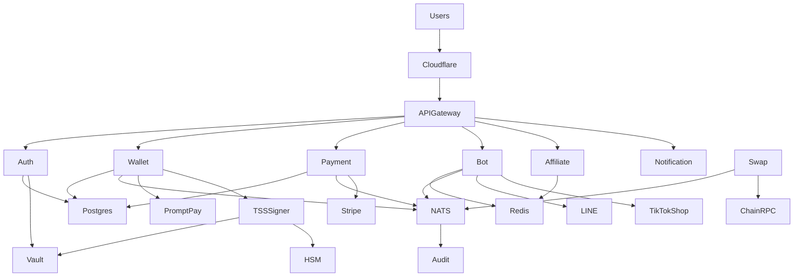

# ZeaZ Ecosystem Repo Audit

Audit date: 2026-05-05 UTC.

## Intake Result

The requested `gh repo clone` command set could not run because `gh` is not installed in the execution environment. A fallback `git clone --depth 1 https://github.com/cvsz/<repo>.git` intake succeeded for 16 of 18 repositories. `zTTato-Platform` and `zeapay` required GitHub credentials or were unavailable to anonymous HTTPS cloning.

## Repo-by-repo Breakdown

| Repo | Intake | Type | Runtime | Execution model | Main features found | Risk highlights | Target service mapping |
|---|---:|---|---|---|---|---|---|
| zgitcp | cloned | installer/docs | shell | imperative installer | bootstrap script and platform notes | shell installer needs idempotency and provenance | GitOps/bootstrap only |
| zwallet | cloned | wallet/API/mobile | TypeScript, Python, Kotlin, SQL | REST + DB transactions | wallet balance, transfer, PromptPay deposit/withdraw, auth register/login, AI anomaly inference, migrations, Android/mobile clients | HMAC-only paths, MPC references in tests, secret fixtures, money movement idempotency required | wallet-service, payment-service, swap-engine, auth-service, audit-service |
| ABTPi18n | cloned | API/strategy/i18n tooling | Python, Node | FastAPI REST + scripts + secret rotation routines | health, auth, exchange keys, strategies, dashboard PnL, Google OAuth, Drive asset sync, i18n migration | OAuth/key exchange paths need central auth, Drive sync secret handling, rotation service must use Vault | auth-service, bot-service, notification-service |
| zypto | cloned | large SaaS/AI/control-plane corpus | Python, YAML, Terraform | REST + schedulers + generated services | auth token/signup/me, health, Stripe checkout, sales CRM, hyperscale generated health services, RBAC/tenant modules | many generated services/configs, JWT module, numerous schedulers, broad cloud clients | auth-service, affiliate-service, audit-service, platform infra |
| ZeaZDev-Omega | cloned | monorepo/contracts/web | TypeScript, Solidity | web/contracts | tokenomics, contracts, package/turbo workspace | smart-contract governance and chain deployment controls required | audit-service, wallet-service integration |
| ztsaff | cloned | TikTok review SaaS/Gitea platform | Node, Python, shell, Terraform | REST + installers + schedulers | register/login/me, dashboard, wallet deposit, transactions, rent plans, Gitea control-plane/scheduler/worker | many shell installers, cron/scheduler paths, `.env` in subtree | affiliate-service, bot-service, auth-service |
| zLinebot | cloned | LINE/TikTok bot/API/platform | TypeScript, Python, SQL, Cloudflare Workers | Fastify REST + webhooks + workers + websocket | metrics, automation, Stripe webhook, TikTok OAuth callback/webhook, LINE webhook, logs, inference, extensive DB schemas | raw webhook verification consistency, Cloudflare deploy scripts, multiple compose stacks | bot-service, notification-service, audit-service |
| zlttbots | cloned | AI/bot/automation mega repo | Python, JavaScript, shell | REST + workers + schedulers + installers | health endpoints, automation flows, memory/vector store, Cloudflare automation, deployment scripts | numerous installer scripts and hidden automation loops, policy review required | bot-service, notification-service, audit-service |
| zttlbots | cloned | lean LINE/TikTok bot | TypeScript | Fastify REST/SSE/WebSocket | healthz, LINE webhook, TikTok webhook, SSE stream, WS stream | direct webhook services need tenant auth and rate limits | bot-service, notification-service |
| zTTato-Platform | failed | unknown | unknown | unknown | not available in anonymous clone | cannot validate; treat as untrusted until cloned with credentials | quarantine backlog |
| zvath | cloned | AI/security SaaS | Python, TypeScript | FastAPI + workers + schedulers | healthz, tenant me, Stripe webhook, generate, OAuth url/callback/refresh, worker queue/trend ingest | swarm/scheduler loops, i18n secret-ish fixtures, tenant boundary must be enforced centrally | auth-service, notification-service, audit-service |
| tiktok-shop-bot | cloned | outreach bot/CLI | Python | CLI batch automation | consent-based outreach, templating, dedupe, rate limiting | outbound messaging compliance, rate-limit persistence | affiliate-service, bot-service |
| tiktokshop-api-client | cloned | PHP API client | PHP Composer | sync SDK | auth request signing and general TikTok Shop requests | signing code takes secrets directly; migrate to integration adapter using Vault | bot-service integration library reference |
| tiktok-shop-sdk | cloned | TypeScript SDK/docs | TypeScript | sync SDK | TikTok Shop modules, examples, docs | test/example tokens and generated cache scan noise; do not run in backend runtime | bot-service integration library reference |
| tiktokshop-php | cloned | PHP SDK | PHP Composer | sync SDK/webhook helper | Auth, Client, Resource, Webhook abstractions | webhook signature validation must be standardized | bot-service integration library reference |
| zLinebot-automos | cloned | autonomous trading/API/bot stack | Python, Node, TS, Terraform, K8s | REST + autonomous loops + workers | register/chat/checkout, auth login/register, portfolio, backtest, webhook, smart router, Stripe billing, orderbook/arb/analytics | autonomous loops, generated secrets script, multiple deploy/install scripts | swap-engine, bot-service, payment-service, audit-service |
| zeaz-platform | cloned | bootstrap stub | shell | imperative | minimal script | no runtime controls | bootstrap only |
| zeapay | failed | unknown payment repo | unknown | unknown | not available in anonymous clone | cannot validate payment code; treat as critical blind spot | payment-service backlog |

## Feature Matrix

| Capability | Source repos | Unified owner | Event subjects |
|---|---|---|---|
| User/org authentication | zwallet, ABTPi18n, zypto, ztsaff, zLinebot-automos, zvath | auth-service | `auth.user.created`, `auth.session.created`, `auth.oauth.linked` |
| Wallet balance/transfer | zwallet, ztsaff | wallet-service | `wallet.account.created`, `wallet.transfer.requested`, `wallet.transfer.settled` |
| Fiat/PromptPay/Stripe payments | zwallet, zLinebot, zvath, zLinebot-automos, zypto | payment-service | `payment.intent.created`, `payment.webhook.received`, `payment.settled` |
| Swap/trading/routing | zwallet, zLinebot-automos | swap-engine | `swap.quote.requested`, `swap.order.submitted`, `swap.order.filled` |
| LINE bot webhooks | zLinebot, zttlbots, zLinebot-automos | bot-service | `bot.line.message.received`, `notification.line.send` |
| TikTok Shop integration | zLinebot, zttlbots, tiktok SDK repos, ztsaff, tiktok-shop-bot | bot-service, affiliate-service | `bot.tiktok.webhook.received`, `affiliate.outreach.requested` |
| Outreach/affiliate automation | tiktok-shop-bot, ztsaff, zypto | affiliate-service | `affiliate.creator.discovered`, `affiliate.message.sent` |
| Notifications/streams | zttlbots, zLinebot, zvath | notification-service | `notification.email.send`, `notification.push.send`, `notification.stream.publish` |
| Audit/compliance/security | zwallet, zypto, zLinebot DB schemas, zvath tests | audit-service | `audit.event.appended`, `security.alert.raised` |
| i18n/Drive assets | ABTPi18n | notification-service / admin workflow | `content.asset.synced`, `content.translation.updated` |

## Dependency Graph

## Security Risk Map

| Risk | Evidence category | Impact | Remediation |
|---|---|---|---|
| Fragmented auth | multiple `/auth/*`, OAuth, HMAC implementations | tenant bypass, inconsistent session lifecycle | central OIDC/JWT in auth-service, service-to-service SPIFFE mTLS, OPA RBAC |
| Direct secret material in app code/tests | token/key patterns in SDK tests and JWT/auth modules | leakage and replay risk | Vault dynamic secrets; no static secrets in repos; sealed K8s secrets only for bootstrap tokens |
| Hidden persistence/installers | many `install.sh`, deployment generators, `.env` files | supply-chain and persistence risk | replace shell installers with signed bootstrap, Terraform, ArgoCD; forbid runtime self-install |
| Autonomous loops/schedulers | `while true`, schedulers, workers across AI/bot repos | runaway spend, unbounded API calls | move to NATS consumers with explicit leases, budgets, and kill switches |
| Webhook inconsistency | LINE/TikTok/Stripe webhooks implemented in several repos | forged callback risk | canonical verifier library in Go; raw body signing; idempotency keys |
| Money movement correctness | wallet/PromptPay/deposit/withdraw/swap endpoints | double spend/lost update | serializable ledger transactions, idempotency table, TLA-backed invariants, audit append |
| Threshold signing gap | MPC references but no central signer | key compromise and non-compliance | tss-signer with tss-lib/FROST protocol boundary, Vault/HSM shares, quorum policy |

## Refactor Roadmap

1. Freeze unsafe installers, cron scripts, and watchdog loops behind repository policy.
2. Put Cloudflare/API gateway in front of all public traffic and route only to Go service adapters.
3. Migrate identity, tenant, RBAC, and OAuth into auth-service.
4. Migrate ledger endpoints into wallet-service with immutable audit events.
5. Migrate payment webhooks into payment-service with idempotent webhook processing.
6. Consolidate LINE/TikTok handlers into bot-service and affiliate-service.
7. Introduce NATS JetStream and convert background jobs into event consumers.
8. Deploy tss-signer in an isolated namespace with Vault transit/HSM-backed share custody.
9. Enable OpenTelemetry, Prometheus, ELK, SIEM rules, and immutable audit storage.
10. Use ArgoCD app-of-apps for dev/staging/prod and progressive rollout.
