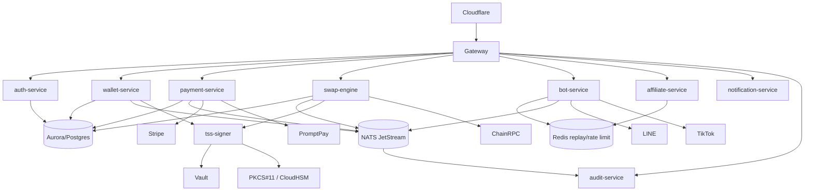

# Repo-by-Repo Deep Analysis

This audit converts the cloned ecosystem into deployable service ownership. Each repository is treated as untrusted input until its behavior is represented by typed Go APIs, policy-controlled workers, immutable audit events, and GitOps-managed infrastructure.

## Feature matrix

| Capability | Source repositories | Current implementation pattern | Unified owner | Required event subjects |
|---|---|---|---|---|
| Identity, OAuth, sessions | `zwallet`, `ABTPi18n`, `zypto`, `ztsaff`, `zvath`, `zLinebot-automos`, `ZeaZDev-Omega` | Duplicated FastAPI/NestJS/Node auth, OAuth callbacks, JWT helpers | `auth-service` | `auth.user.created`, `auth.session.created`, `auth.oauth.linked`, `auth.token.revoked` |
| Tenant/RBAC/security policy | `zwallet`, `zypto`, `zvath`, `zlttbots` | Middleware fragments, OPA experiments, admin panels | `auth-service` + `audit-service` | `security.policy.evaluated`, `security.alert.raised` |
| Wallet ledger and transfer | `zwallet`, `ztsaff`, unaudited `zeapay` | TypeScript/Python ledger code, PromptPay endpoints, installer-managed DBs | `wallet-service` | `wallet.account.created`, `wallet.transfer.requested`, `wallet.transfer.settled` |
| Fiat payments and billing | `zwallet`, `zLinebot`, `zvath`, `zLinebot-automos`, `ZeaZDev-Omega`, `zypto` | Stripe/PromptPay/webhook handlers in several apps | `payment-service` | `payment.intent.created`, `payment.webhook.received`, `payment.settled`, `payment.failed` |
| Swap/trading/router | `zwallet`, `ABTPi18n`, `zLinebot-automos`, `zypto` | Trading strategies, risk managers, smart router, backtests | `swap-engine` | `swap.quote.requested`, `swap.order.accepted`, `swap.order.filled`, `risk.limit.exceeded` |
| LINE/TikTok bot ingestion | `zLinebot`, `zttlbots`, `zLinebot-automos`, `zlttbots` | Webhooks, SSE/WebSocket streams, shell deploys | `bot-service` | `bot.line.message.received`, `bot.tiktok.webhook.received` |
| TikTok Shop SDK/client logic | `tiktok-shop-sdk`, `tiktokshop-api-client`, `tiktokshop-php`, `zLinebot`, `ztsaff` | TypeScript/PHP request signing and resource clients | `bot-service` integration package | `integration.tiktok.request.signed`, `integration.tiktok.webhook.verified` |
| Affiliate/outreach automation | `tiktok-shop-bot`, `ztsaff`, `zlttbots`, `zypto` | CLI campaigns, schedulers, local dedupe/rate limits | `affiliate-service` | `affiliate.campaign.created`, `affiliate.creator.discovered`, `affiliate.message.sent` |
| Notifications/streams | `zLinebot`, `zttlbots`, `ABTPi18n`, `zvath` | LINE Notify, Telegram, email/push, WebSocket/SSE | `notification-service` | `notification.send.requested`, `notification.sent`, `notification.failed` |
| Audit/compliance/SIEM | `zwallet`, `zypto`, `zvath`, `zLinebot` | Structured loggers, audit stores, security tests | `audit-service` | `audit.event.appended`, `audit.export.requested` |
| i18n and Drive assets | `ABTPi18n` | Google Drive loaders, frontend i18n | `notification-service` + admin workflows | `content.asset.synced`, `content.translation.updated` |
| Threshold signing/MPC | `zwallet`, `zypto`, `zLinebot-automos` | MPC references and generated crypto experiments | `tss-signer` | `signing.requested`, `signing.quorum.formed`, `signing.completed`, `signing.denied` |

## Per-repository execution-flow findings

### `zgitcp`
- **Features:** bootstrap/install instructions and repository setup helpers.
- **Entrypoints:** shell script execution from a host terminal.
- **Hidden paths:** host mutation and package installation patterns must be considered persistence-capable even when intended as setup.
- **Security posture:** no production runtime should call these scripts. Preserve only signed, reviewed bootstrap intent in `scripts/bootstrap.sh`.

### `zwallet`
- **Features:** wallet account management, double-entry ledger concepts, transfers, PromptPay deposit/withdrawal, swap orchestration, admin/security panels, Kubernetes/Terraform/docker assets, Redis/Kafka/outbox/idempotency modules, mobile Kotlin elements.
- **Entrypoints:** FastAPI/Python API, TypeScript API, admin panel, Dockerfiles, docker-compose stacks, migration/install/rollback scripts, Kubernetes operator deploy script.
- **Runtime flows:** request -> auth/security middleware -> idempotency -> service -> DB/repository -> outbox/Kafka/audit; swap paths add liquidity manager, clearing engine, settlement engine, blockchain client, and fraud/risk services.
- **Risk:** high money-movement exposure, inconsistent auth between Python and TypeScript stacks, installer-controlled infra, secret injection modules, webhook handler divergence.
- **Migration:** ledger tables and transfer invariants move to `wallet-service`; PromptPay and Stripe move to `payment-service`; swap/risk/outbox to `swap-engine`; all audit writes to `audit-service`.

### `ABTPi18n`
- **Features:** FastAPI backend, Next frontend, authentication, Google OAuth/Drive sync, trading strategy registry, backtesting, portfolio, PromptPay/rental/payment endpoints, Telegram/notification services, Celery worker tasks.
- **Entrypoints:** `apps/backend/main.py`, `apps/backend/worker.py`, frontend Dockerfile, install/verify scripts, Drive sync scripts.
- **Runtime flows:** API request -> auth/audit middleware -> trading/payment/portfolio services; Celery beat/worker -> scheduled sync/trading notifications; frontend -> backend APIs.
- **Hidden paths:** Drive asset loaders and secret rotation endpoints can mutate runtime state outside a release. Celery beat represents implicit persistence.
- **Migration:** strategies become approved `swap-engine` jobs; Google/Telegram/notification flows move to `notification-service`; auth and secret rotation move to `auth-service`/Vault.

### `zypto`
- **Features:** generated control-plane services, global identity, mTLS/channel binding, OPA policy, decentralized scheduling/market/ledger, Terraform/K8s/YAML fleets, AI/fraud/cost optimization, zk/prover stubs, TSS experiments.
- **Entrypoints:** Python APIs, generated Docker/Kubernetes assets, Terraform, OPA Dockerfile, shell generator scripts, Go prover stub.
- **Runtime flows:** control plane -> scheduler/router -> data/AI/decentralized workers -> observability/audit; identity modules issue/verify attestations and risk decisions.
- **Hidden paths:** very large generated YAML/script surface creates supply-chain drift and accidental deploy risk.
- **Migration:** keep identity/risk/policy concepts, but collapse generated fleets into explicit Go services and GitOps modules in this repository.

### `ZeaZDev-Omega`
- **Features:** NestJS backend, miniapp frontend, Solidity contracts, game sessions, rewards, World ID, DeFi quote/stake, Thai bank/card fintech.
- **Entrypoints:** NestJS controllers/modules, Hardhat deploy scripts, frontend app, docker-compose.
- **Runtime flows:** frontend -> NestJS auth/game/rewards/defi/fintech controllers -> Prisma/database and blockchain/fintech providers.
- **Risk:** contract deployment must be gated by audit and signer controls; fintech endpoints overlap with wallet/payment responsibilities.
- **Migration:** identity to `auth-service`; rewards/game events to `affiliate-service` or a future rewards bounded context; DeFi to `swap-engine`; fintech to `payment-service`.

### `ztsaff`
- **Features:** Gitea/TikTok affiliate platform, runner orchestration, wallet deposit/transaction/rent plans, scheduler/worker controls, Terraform and many installer/export variants.
- **Entrypoints:** large shell installer set, docker-compose variants, Python scheduler, Gitea APIs, webhook workers.
- **Runtime flows:** installer -> compose stack -> Gitea/webhook/worker/autoscaler -> queue/Redis/S3; affiliate/dashboard routes interact with wallet/rental flows.
- **Risk:** highest script risk count; repeated generated installers include `sudo`, `systemctl`, `curl`, secret files, webhook shells, and local health loops.
- **Migration:** no installer is admitted. Affiliate and runner semantics become NATS jobs with leases, budgets, signed worker images, and audit events.

### `zLinebot`
- **Features:** LINE bot, TikTok OAuth/webhook, Stripe webhook, Cloudflare Worker assets, websocket/log/inference APIs, monitoring/observability install scripts, blue/green compose stacks, SQL schemas.
- **Entrypoints:** TypeScript/Python services, Cloudflare Worker deploys, `deploy*.sh`, `install*.sh`, watchdog/self-heal scripts, Dockerfiles/compose.
- **Runtime flows:** external webhook -> signature verification -> bot command/router -> LINE/TikTok/Stripe/DB/metrics; deploy scripts mutate Cloudflare and local Docker state.
- **Risk:** watchdog/self-heal behavior and shell-driven deploys violate stateless production constraints; webhook verification must be canonicalized.
- **Migration:** webhooks to `bot-service`; outbound messages to `notification-service`; Cloudflare config to Terraform/API script in this repo only.

### `zlttbots`
- **Features:** autonomous bot/AI tooling, memory/vector endpoints, start/stop scripts, PM2 ecosystem, enterprise compose, generated setup/log files.
- **Entrypoints:** shell start/stop/generation scripts, Python/JS services, PM2 config, docker-compose.
- **Runtime flows:** start script -> process manager -> bots/automation/vector memory -> external APIs/logs.
- **Risk:** 142 runtime script/config hits and 608 risk-pattern hits show broad persistence/automation surface. PM2/watch-style host orchestration is not production-admissible.
- **Migration:** convert permitted automations to bounded `affiliate-service` or `notification-service` consumers with queue leases and kill switches.

### `zttlbots`
- **Features:** Fastify TypeScript bot, LINE webhook, TikTok webhook, health endpoint, SSE/WebSocket streams, SQL.
- **Entrypoints:** Node service, shell scripts, compose/Kubernetes configs.
- **Runtime flows:** webhook -> bot handlers -> stream fanout -> database/audit.
- **Risk:** duplicated bot webhook verification and script-based runtime management.
- **Migration:** consolidate into `bot-service` with tenant-aware rate limits and common replay cache.

### `zvath`
- **Features:** FastAPI AI security SaaS, tenant `me`, Stripe webhook, generation route, OAuth URL/callback/refresh, queue/trend workers, SOC/OPA/compliance tests.
- **Entrypoints:** API app, worker modules, Kubernetes YAML, SQL migrations/tests.
- **Runtime flows:** authenticated API -> org/RBAC checks -> generation/workers -> audit/compliance; OAuth callback -> token storage/refresh.
- **Risk:** tenant isolation and OAuth state validation are high-value controls that must be centralized; Stripe webhook duplicates payment handling.
- **Migration:** auth/OAuth to `auth-service`; Stripe to `payment-service`; audit/compliance events to `audit-service`.

### TikTok SDK/client repositories
- **Features:** TypeScript and PHP TikTok Shop request/resource/webhook abstractions, signature helpers, tests/docs.
- **Entrypoints:** library imports only.
- **Runtime flows:** caller builds signed HTTP requests and parses responses/webhooks.
- **Risk:** SDK tests and examples inflate secret-pattern scans; deployed services must not pass raw app secrets to SDK objects.
- **Migration:** port signing to a Go adapter that retrieves secrets from Vault, validates webhooks over raw body bytes, records idempotency keys, and emits audit events.

### `zLinebot-automos`
- **Features:** autonomous trading/bot/API stack, chat/register/checkout, portfolio, backtest, smart router, orderbook/arbitrage/analytics, billing, Terraform/Kubernetes, secret generation.
- **Entrypoints:** JS/TS/Python APIs, shell installers, `gen-secrets.sh`, deploy scripts, compose/Kubernetes.
- **Runtime flows:** user/chat/webhook -> auth/billing/portfolio/trading services -> smart router/orderbook -> analytics and notifications.
- **Risk:** generated secrets and autonomous loops are incompatible with Vault-managed, audited production. Trading must be bounded by risk policy and queue budgets.
- **Migration:** chat/bot to `bot-service`; checkout/billing to `payment-service`; portfolio/trading/backtest to `swap-engine`; secrets to Vault.

### `zeaz-platform`, `zTTato-Platform`, `zeapay`
- **`zeaz-platform`:** one shell bootstrap stub. Replace with deterministic `scripts/bootstrap.sh` and GitOps.
- **`zTTato-Platform`:** inaccessible; production import blocked.
- **`zeapay`:** inaccessible payment repo; treat as a critical blind spot and rebuild payment interfaces from audited schemas/contracts only.

## Duplicated logic and hidden coupling

- Auth/session/OAuth logic exists in at least seven cloned repos and is coupled to webhooks, billing, admin panels, and AI generation.
- Wallet/payment/swap responsibilities are mixed across `zwallet`, `zLinebot-automos`, `ZeaZDev-Omega`, `ztsaff`, and unavailable `zeapay`.
- LINE/TikTok webhook verification is duplicated across bot repos and SDK libraries.
- Host orchestration is split across shell scripts, PM2, docker-compose, Cloudflare Workers scripts, Terraform snippets, and Kubernetes YAML.
- Audit logging appears as local structured loggers or DB tables instead of a single immutable event contract.

## Service interaction graph

