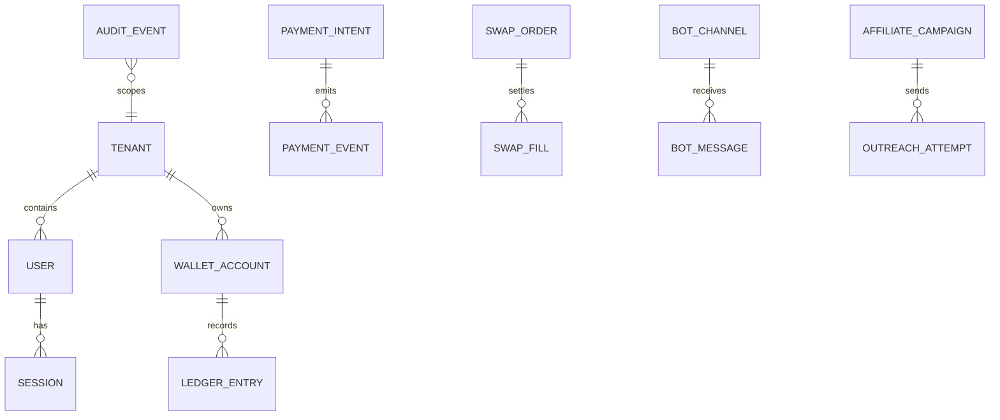
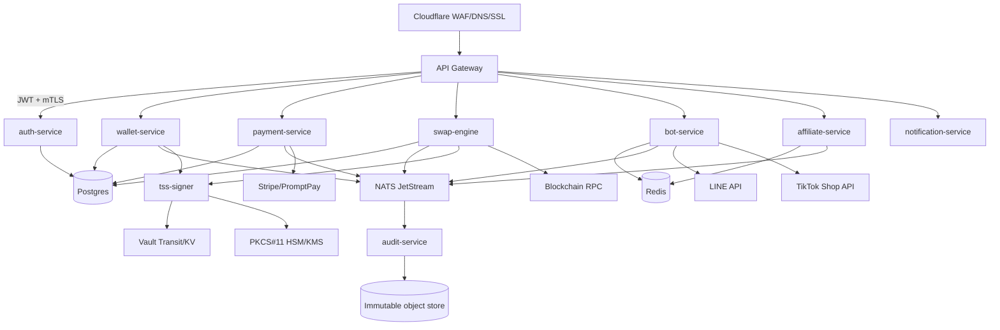

# Unified Enterprise Architecture

## Service Boundaries

- **auth-service** owns tenants, users, org membership, OAuth links, JWT issuance, RBAC decisions, and SPIFFE identity mapping.
- **wallet-service** owns ledger accounts, balances, transfers, idempotency, and signing requests.
- **payment-service** owns fiat/crypto payment intents, PromptPay/Stripe webhooks, settlement reconciliation, and refunds.
- **swap-engine** owns quotes, routing, order lifecycle, risk checks, and chain/RPC adapters.
- **bot-service** owns LINE and TikTok inbound webhooks, normalized bot commands, and conversation state.
- **affiliate-service** owns creator discovery, consent records, outreach campaigns, TikTok Shop affiliate APIs, and anti-spam budgets.
- **notification-service** owns email, LINE push, TikTok messages, server-sent events, web push, and i18n content distribution.
- **audit-service** owns immutable event append, SIEM enrichment, retention, and evidence export.
- **tss-signer** is isolated from the public API plane and signs only policy-approved payloads after quorum validation.

## Unified API Surface

| Method | Path | Owner | Authz |
|---|---|---|---|
| POST | `/v1/auth/register` | auth-service | public + abuse controls |
| POST | `/v1/auth/login` | auth-service | public + MFA policy |
| GET | `/v1/auth/me` | auth-service | `user:read:self` |
| GET | `/v1/wallet/accounts` | wallet-service | `wallet:read` tenant scope |
| POST | `/v1/wallet/transfers` | wallet-service | `wallet:transfer:create` + risk approval |
| POST | `/v1/payments/intents` | payment-service | `payment:create` |
| POST | `/v1/webhooks/stripe` | payment-service | Stripe signature + replay cache |
| POST | `/v1/swaps/quotes` | swap-engine | `swap:quote` |
| POST | `/v1/swaps/orders` | swap-engine | `swap:execute` + signer policy |
| POST | `/v1/bots/line/webhook` | bot-service | LINE signature verifier |
| POST | `/v1/bots/tiktok/webhook` | bot-service | TikTok signature verifier |
| POST | `/v1/affiliate/campaigns` | affiliate-service | `affiliate:campaign:create` |
| POST | `/v1/notifications` | notification-service | `notification:send` |
| GET | `/v1/audit/events` | audit-service | `audit:read` break-glass logged |

## Domain Model

## Architecture Diagram

## Zero Trust Controls

- Every workload receives a SPIFFE ID: `spiffe://zeaz.dev/ns/<namespace>/sa/<service-account>`.
- Ingress JWT identifies the user and tenant; mTLS identifies the workload; OPA evaluates both.
- No service may call another service except through an allow-listed SPIFFE policy.
- Secrets are resolved at runtime from Vault using Kubernetes auth and short TTL leases.
- Egress to LINE, TikTok, Stripe, PromptPay, and chain RPC is allow-listed through the gateway namespace.

## Vault + HSM + TSS Signer Design

- Vault stores encrypted key-share metadata and issues short-lived DB/API credentials.
- HSM integration uses PKCS#11 handles for wrapping/unwrapping local TSS shares where supported.
- `tss-signer` exposes only internal mTLS endpoints: `/v1/tss/keygen`, `/v1/tss/sign`, `/healthz`, `/metrics`.
- Signing policy requires tenant scope, request nonce, chain ID, operation type, risk decision, and quorum approval.
- Shares are never exported as plaintext logs or API responses; audit-service receives hashes, policy IDs, and signer participant IDs only.

## Real TSS Implementation Outline

The scaffold includes deterministic request validation and policy gating. Production signing plugs the `crypto.Signer` interface into either Binance `tss-lib` ECDSA or a FROST implementation:

1. Use NATS subjects `tss.keygen.<tenant>` and `tss.sign.<tenant>` for participant coordination.
2. Persist participant state encrypted in Vault KV v2 and wrap local share files with PKCS#11.
3. Run at least five signer pods across three zones with threshold `3-of-5`.
4. Require OPA policy success before broadcasting a signing round.
5. Emit `audit.event.appended` with digest, participant set, policy decision, and latency.
6. Refuse signing if tenant risk score, chain allow-list, nonce replay, or quorum freshness checks fail.

## Observability + SIEM

- Metrics: Prometheus scrapes `/metrics` on all services and Alertmanager pages SREs.
- Tracing: OpenTelemetry Collector exports traces to Tempo/OTLP-compatible backend.
- Logs: Fluent Bit ships JSON logs to Elasticsearch data streams.
- SIEM: ElastAlert rules flag auth spikes, webhook replay attempts, signer denials, privilege escalation, and anomalous transfer velocity.
- Audit: append-only audit events are hashed and periodically checkpointed to immutable object storage.

## GitOps and Deployment

- Terraform creates multi-region Kubernetes, Vault, DNS, object stores, and network boundaries.
- ArgoCD app-of-apps deploys base manifests plus dev/staging/prod overlays.
- Progressive delivery uses blue/green services and canary weights at the ingress layer.
- Rollback is declarative: revert the Git commit or sync a previous ArgoCD application revision.

## Validation Plan

- Load test API gateway and services with tenant-isolated scenarios: auth login, wallet transfer, bot webhook bursts, payment webhook replay.
- Chaos test one AZ loss, NATS leader failover, Postgres replica promotion, Redis eviction, Vault sealed state, and signer participant loss.
- Recovery procedures: restore Postgres PITR, replay JetStream durable consumers, rotate leaked webhook secrets, rekey Vault, and revoke SPIFFE identities.

## Concrete generated implementation assets

| Asset | Purpose |
|---|---|
| `platform/api/openapi.yaml` | Gateway contract and service ownership for auth, wallet, payment, swap, bot, affiliate, notification, and audit routes. |
| `platform/db/migrations/001_core_schema.sql` | Postgres tenant isolation, wallet account, double-entry ledger, payment intent, and hash-linked audit schema. |
| `platform/deploy/kubernetes/base/services.yaml` | Explicit deployments, services, HPAs, PDBs, service account, strict config, and default-deny network controls for every target Go microservice. |
| `platform/deploy/terraform/modules/eks/main.tf` | Multi-AZ private EKS with encrypted control-plane logs, KMS secret encryption, dedicated signer node pool, and workload node pools. |
| `platform/deploy/terraform/modules/data-plane/main.tf` | Encrypted Aurora PostgreSQL and Redis multi-AZ data plane with managed secrets and deletion protection. |
| `scripts/audit-repos.sh` | Repeatable repo evidence extraction without hidden mutation or host persistence. |
