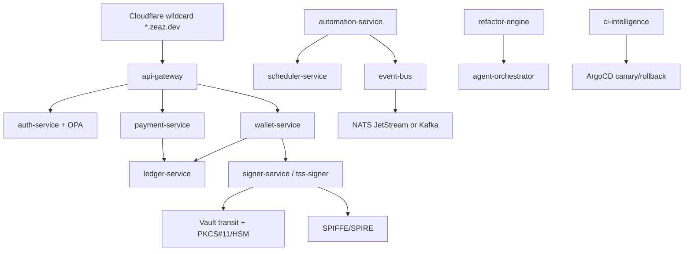

# ZeaZ v19 Delivery Blueprint

ZeaZ v19 is delivered as a deterministic Go microservice platform with zero-trust service identity, tenant-scoped APIs, double-entry ledger validation, an isolated threshold-signer boundary, and a guarded autonomous agent control plane.

## Unified project structure

```text
.github/workflows/platform-ci.yml
.gitignore
.gitkeep
README.md
docs/generated/full-spectrum-analysis.md
docs/generated/function-api-inventory.md
docs/production-deployment-guide.md
docs/repo-audit.md
docs/security-risk-report.md
docs/source-inventory.md
docs/unified-architecture.md
docs/zeaz-v19-delivery.md
infra/argocd/application.yaml
infra/kubernetes/zeaz-v19.yaml
infra/observability/prometheus.yaml
infra/opa/zeaz.rego
infra/terraform/main.tf
infra/vault/zeaz.hcl
platform/api/openapi.yaml
platform/cmd/affiliate-service/main.go
platform/cmd/agent-orchestrator/main.go
platform/cmd/api-gateway/main.go
platform/cmd/audit-service/main.go
platform/cmd/auth-service/main.go
platform/cmd/automation-service/main.go
platform/cmd/bot-service/main.go
platform/cmd/bot-service/main_test.go
platform/cmd/ci-intelligence/main.go
platform/cmd/event-bus/main.go
platform/cmd/ledger-service/main.go
platform/cmd/notification-service/main.go
platform/cmd/payment-service/main.go
platform/cmd/refactor-engine/main.go
platform/cmd/scheduler-service/main.go
platform/cmd/signer-service/main.go
platform/cmd/swap-engine/main.go
platform/cmd/tss-signer/main.go
platform/cmd/wallet-service/main.go
platform/db/migrations/001_core_schema.sql
platform/deploy/argocd/app-of-apps.yaml
platform/deploy/cloudflare/dns-record.sh
platform/deploy/cloudflare/provision-zone.sh
platform/deploy/docker/Dockerfile
platform/deploy/kubernetes/base/external-secrets.yaml
platform/deploy/kubernetes/base/gateway-rollouts.yaml
platform/deploy/kubernetes/base/kustomization.yaml
platform/deploy/kubernetes/base/namespace.yaml
platform/deploy/kubernetes/base/services.yaml
platform/deploy/kubernetes/overlays/dev/kustomization.yaml
platform/deploy/kubernetes/overlays/prod/kustomization.yaml
platform/deploy/kubernetes/overlays/staging/kustomization.yaml
platform/deploy/observability/elastic/filebeat.yaml
platform/deploy/observability/otel/collector.yaml
platform/deploy/observability/prometheus/prometheus.yml
platform/deploy/observability/siem/rules.yaml
platform/deploy/packer/golden-image.pkr.hcl
platform/deploy/spire/server.conf
platform/deploy/terraform/envs/prod/main.tf
platform/deploy/terraform/envs/prod/variables.tf
platform/deploy/terraform/modules/data-plane/main.tf
platform/deploy/terraform/modules/eks/main.tf
platform/deploy/terraform/modules/gke/main.tf
platform/deploy/terraform/modules/global-dns/main.tf
platform/deploy/vault/policies.hcl
platform/go.mod
platform/go.sum
platform/internal/agents/agents.go
platform/internal/agents/agents_test.go
platform/internal/app/app.go
platform/internal/audit/audit.go
platform/internal/audit/audit_test.go
platform/internal/config/config.go
platform/internal/crypto/signer.go
platform/internal/crypto/signer_test.go
platform/internal/events/events.go
platform/internal/events/events_test.go
platform/internal/integration/webhook.go
platform/internal/integration/webhook_test.go
platform/internal/ledger/ledger.go
platform/internal/ledger/ledger_test.go
platform/internal/rbac/rbac.go
platform/internal/rbac/rbac_test.go
platform/internal/server/server.go
scripts/audit-repos.sh
scripts/bootstrap.sh
scripts/clean-os.sh
scripts/cloudflare-provision.sh
scripts/deploy-unified-stack.sh
scripts/full-spectrum-audit.py
scripts/meta-installer.sh
scripts/safe-deploy.sh
```

## Repository normalization outcome

The input repositories are classified into five bounded contexts:

| Domain | Source repositories | Target services |
| --- | --- | --- |
| Fintech wallet and payments | zwallet, zypto, zeapay | wallet-service, payment-service, ledger-service, signer-service |
| Automation and commerce | zLinebot, zlttbots, zttlbots, zLinebot-automos, tiktok-shop-bot, tiktokshop-api-client, tiktok-shop-sdk, tiktokshop-php, zTTato-Platform | automation-service, scheduler-service |
| Dev platform | zgitcp, ZeaZDev-Omega, zeaz-platform | refactor-engine, ci-intelligence, agent-orchestrator |
| Identity and policy | zvath, ABTPi18n | auth-service, api-gateway, OPA, Vault, SPIRE |
| Affiliate and notifications | ztsaff | affiliate-service, notification-service |

Static extraction is repeatable through `scripts/full-spectrum-audit.py`, which writes function/API inventories into `docs/generated`. Runtime duplication is reduced by `platform/internal/app`, `platform/internal/rbac`, `platform/internal/audit`, and `platform/internal/server`.

## Cross-repository dependency graph



## Security and autonomy controls

* All non-health routes require `X-Tenant-ID`; privileged routes require explicit `X-Zeaz-Scope` values.
* The signer validates FROST/tss-lib quorum proof metadata and SPIFFE trust-domain membership before accepting aggregate signatures.
* Ledger journals fail closed unless every currency balances to zero.
* Agent orchestration topologically sorts deterministic DAG tasks and rejects missing dependencies or cycles.
* GitOps deployment is ArgoCD-managed with canary promotion and rollback hooks in CI.

## Production bootstrap

1. Run `./scripts/meta-installer.sh` in default validate mode; it performs no DNS, cluster, service, cron, or hidden persistence mutations.
2. Configure cloud credentials and secrets in environment variables only.
3. Run `MODE=deploy ./scripts/meta-installer.sh` to apply Kubernetes and ArgoCD manifests.
4. Use `scripts/cloudflare-provision.sh '*'` to provision dynamic wildcard DNS when Cloudflare credentials are present.
